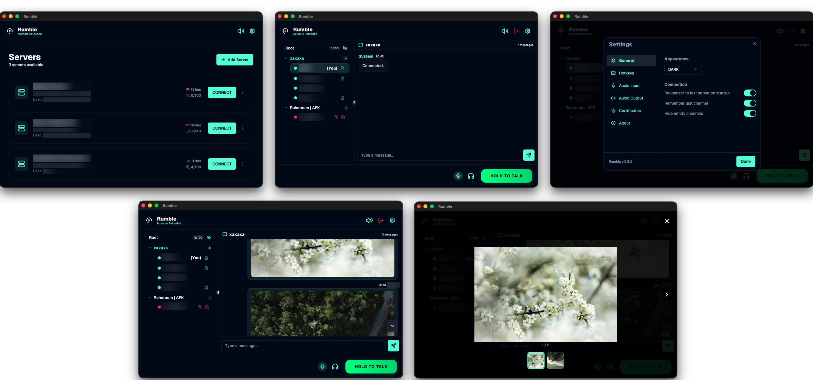
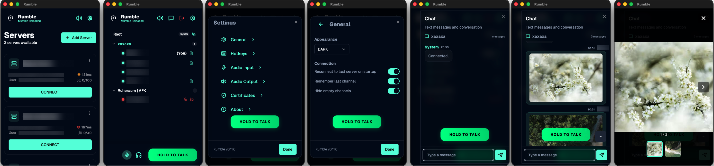

# Rumble | Mumble Reloaded

**Rumble** is a **free and open-source** alternative Mumble client designed to bring a modern UI/UX to the rock-solid Mumble protocol.




The goal of Rumble is to create a seamless experience across all platforms—Mobile, Tablet, and Desktop. While we strive for the high performance and low latency that Mumble is known for, Rumble's primary focus is on **user convenience** and **modern UI/UX**. From intuitive offline indicators to helpful setup guides for macOS accessibility permissions, we believe that a great user experience is just as important as the protocol itself.


## Platform Support Matrix

| Platform | Works | Does not work |
| :--- | :---: | :---: |
| Android | x | |
| iOS (Tablet and iPhones)| x |  |
| macOS (Apple Silicon and Intel) | x | |
| Windows | x | |
| Linux | (x)* | |
| Web (can't work) | | x |

\* *Experimental. Testing is ongoing for these platforms.*


## Why Rumble?

- **Modern UI/UX**: A fresh, high-quality interface.
- **Free and Open Source**: No hidden fees, no trackers, and no proprietary lock-in. Just a pure community-driven project.

- **Cross-Platform**: Built to work everywhere. One codebase, one experience.

- **Interoperable**: Rumble works in tandem with original Mumble clients. You can switch to Rumble without forcing your friends or community to change anything.
- **AI-Assisted Development**: This project is developed by a human programmer with significant assistance from AI to speed up boilerplate and implementation.

Rumble is currently in active development.

## Build Requirements

These instructions assume you are using **macOS** on Apple Silicon and have homebrew installed.

### Core Requirements
- **CMake**: Required for both Android and iOS builds.
  ```bash
  brew install cmake
  brew install protobuf
  ```
- **Rust**:
  - **Install**: `curl --proto '=https' --tlsv1.2 -sSf https://sh.rustup.rs | sh`
  - **Update**: `rustup update`
  - **Targets**:
    ```bash
    # For iOS
    rustup target add aarch64-apple-ios
    # For iOS (Silicon Simulator)
    rustup target add aarch64-apple-ios-sim
    # For macOS (Silicon)
    rustup target add aarch64-apple-darwin
    # For macOS (Intel)
    rustup target add x86_64-apple-darwin
    # For Android (ARM64)
    rustup target add aarch64-linux-android
    # For Windows (x64)
    rustup target add x86_64-pc-windows-msvc
    ```

### Android
- **Android Studio**: `brew install android-studio`
- **SDK & NDK**: NDK version `28.2.13676358` is required (install via Android Studio SDK Manager).
- **Java**: JDK 21 is required (bundled with modern Android Studio).

### iOS
- **Xcode**: Required for building iOS and macOS applications.

### Windows
- **Visual Studio 2022**: Required with the "Desktop development with C++" workload. This must be built on a Windows machine.
- **Build Tools**:
  - **Perl**: Required for building OpenSSL (e.g., [Strawberry Perl](https://strawberryperl.com/) or `choco install strawberryperl`).
  - **NASM**: Required for assembly optimizations (or `choco install nasm`).
  - **CMake**: Required for C++ dependencies.
- **Command**: `flutter build windows --release`

## macOS Permissions
- Accessibility permissions are required for global hotkeys (standard for macOS chat apps).


### Currently Supported
- **Mobile/Tablets(Android, iOs)**: Full voice functionality with hotkey/PTT support.
- **Desktop (macOS, Linux, Windows)**: Global hotkey activation (Push-to-Talk) is functional across all three desktop platforms.

### Audio Architecture (The "Rumble" Standard)
To ensure reliable audio on mobile (especially iOS), Rumble uses a custom high-performance audio pipeline:
- **Persistent Voice Stream**: Unlike other clients that restart the audio session on every PTT press, Rumble keeps a single persistent stream for the entire connection. This prevents server-side packet loss and reduces PTT latency.
- **Warm Mic Layer**: The hardware microphone and Opus encoder are pre-warmed at app startup and stay alive. This eliminates the "first-syllable-cut-off" common in VoIP apps.
- **iOS VoIP Integration**: Fully utilizes `AVAudioSession` with `playAndRecord` and `voiceChat` modes, ensuring your voice is heard even when the app is in the background or bluetooth devices are connected.
- **Self-Healing Hardware**: On every server reconnect or switch, Rumble re-verifies the hardware microphone status to recover from system-level audio interruptions.

### Planned for the Future
see PLAN.md

## Tech Stack
- **Framework**: Flutter
- **UI System**: shadcn_ui (Flutter implementation)
- **State Management**: Provider

## Branding
If you update `assets/icon.png`, you can regenerate all app icons and splash screens for all platforms by running:
```bash
./scripts/update_branding.sh
```

## Disclaimer & No Warranty

THE SOFTWARE IS PROVIDED "AS IS", WITHOUT WARRANTY OF ANY KIND, EXPRESS OR IMPLIED, INCLUDING BUT NOT LIMITED TO THE WARRANTIES OF MERCHANTABILITY, FITNESS FOR A PARTICULAR PURPOSE AND NONINFRINGEMENT. IN NO EVENT SHALL THE AUTHORS OR COPYRIGHT HOLDERS BE LIABLE FOR ANY CLAIM, DAMAGES OR OTHER LIABILITY, WHETHER IN AN ACTION OF CONTRACT, TORT OR OTHERWISE, ARISING FROM, OUT OF OR IN CONNECTION WITH THE SOFTWARE OR THE USE OR OTHER DEALINGS IN THE SOFTWARE.

---

*Developed with ❤️ and 🤖*
